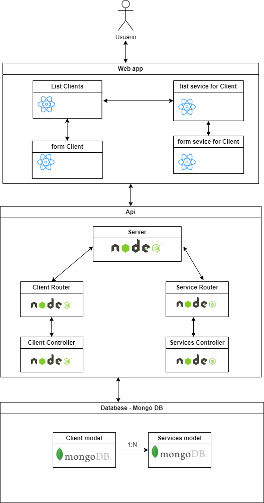

# 1. PRUEBA TÉCNICA DESARROLLO

## DESCRIPCIÓN DEL PROBLEMA

La empresa Celsia Internet S.A.S. requiere implementar una solución para su proceso de venta que permita la captura de información de los clientes y la contratación de uno o varios servicios del portafolio de internet.

El ejercicio consiste en implementar un backend y frontend con su configuración de despliegue en contenedores, para el registro y consulta de la información de los servicios contratados por los clientes, de acuerdo con el modelo de datos presentado a continuación.

## MODELO DE DATOS

Las tablas donde se almacena la información son las siguientes:

```console
CREATE TABLE clientes {
  identificacion VARCHAR(20) NOT NUL PRIMARY KEY,
  nombres VARCHAR(80) NOT NULL,
  apellidos VARCHAR(80) NOT NULL,
  tipoIdentificacion VARCHAR(2) NOT NULL,
  fechaNacimiento DATE NOT NULL,
  numeroCelular VARCHAR(20) NOT NULL,
  correoElectronico VARCHAR(80) NOT NULL
};


CREATE TABLE servicios {
  identificacion VARCHAR(20) NOT NUL,
  servicio VARCHAR(80) NOT NUL,
  fechaInicio DATE NOT NULL,
  ultimaFacturacion DATE NOT NULL,
  ultimoPago INTEGER NOT NUL DEFAULT 0,
  PRIMARY KEY (identificacion, servicio),
  CONSTRAINT servicios_FK1 FOREING KEY (identificacion) REFERENCES clientes(identificacion) ON UPDATE CASCADE ON DELETE NO ACTION
}
```

Para la prueba se deben crear las tablas en el motor de base de datos de su preferencia. Sobre esta base se deben almacenar los registros de los clientes y servicios que se especifican para la prueba.

## Puntos de la prueba

1.1. Implemente en el lenguaje de su preferencia, una `CRUD (Create, Read, Update and Delete)` que permita capturar y administrar la información de los clientes y sus servicios.

1.2. Se deben realizar las siguientes validaciones:

- No dejar datos en blanco.
- El tipo de dato, de acuerdo con la estructura en la base de datos.
- Si el registro ya existe muestre el mensaje `“El registro ya existe”`.

  1.3. Implementar un formulario que permita registrar los servicios contratados de los clientes. `Nota: Tener en cuenta integridad referencial.`

  1.4. Implementar un formulario para la consulta por número de identificación, la información de un cliente y los servicios que tiene contratados.

TIPS:

a. Para el campo `tipoIdentificacion` ingresar solamente los siguientes valores:

- CEDULA → CC
- TARJETA IDENTIDAD → TI
- CEDULA EXTRANJERIA → CE
- REGISTRO CIVIL → RC

b. Para el campo `servicio` ingresar solamente los siguientes tipos:

- Internet 200 MB
- Internet 400 MB
- Internet 600 MB
- Directv Go
- Paramount+
- Win+

c. Se evaluará el uso de patrones de diseño, en backend y frontend, la configuración de despliegue en contenedores y de la imagen a desplegar.

d. En el docker-compose se debe incluir la configuración del servicio de base de datos que haya escogido y una política de manejo de logs para cada servicio.

## ENTREGABLE

Se espera como resultado un clone del repositorio `https://github.com/celsia-internet/pruebas.git`, con la siguiente estructura.

```
api/
|-- docker-compose.yml
|-- Dockerfile
|-- README.md
|-- ...
webapp/
|-- docker-compose.yml
|-- Dockerfile
|-- README.md
|-- ...
```

El repositorio de la prueba deberá estar publicado en `github` de manera pública con el nombre `prueba-celsia-internet` usando git-flow por desarrollador.

```
main/
|-- develop
||-- <desarrollador>
```

# 2. PRUEBA TEORICO-PRACTICA

Para el desarrollo de la prueba teórica, tendrás que escribir tus respuestas en el archivo README.md del repositorio, tomando como referencia la aplicación desarrollada en la `PRUEBA TÉCNICA DE DESARROLLO`.

## PREGUNTAS

2.1. Elabore un diagrama de componentes de la aplicación. Debe cargar el archivo en la siguiente ruta del repositorio: `./assets/diagrama.png`

- RTA: 

  2.2. ¿Qué mecanismos de seguridad incluirías en la aplicación para garantizar la protección del acceso a los datos?

- RTA:

  - Para la protección de los datos implementaría de autentificación mediante de un JWT, de igual forma agregaría un limite de tiempo al mismo haciendo que requiera de un refreshToken

  - Implementaría un sistema de roles (usuarios administrativos y usuarios clientes) que según los roles se asignarían rutas protegidas, rutas publicas, acciones y permisos de usuarios para gestionar la data mas confidencial.

  - Implementaría un cifrado de parámetros por enviados por url, como el DNS, principalmente para proteger la privacidad de las consultas DNS y evitar la manipulación de datos

    2.3. ¿Qué estrategia de escalabilidad recomendarías para la aplicación considerando que el crecimiento proyectado será de 1,000,000 de clientes por año?

- RTA:

  - Priemero seria cambiar la arquitectura y cambiarla a una basada en microservicios bajo el patron de un apigatewat centralizado.

  - Implementar un API Gateway para gestionar las solicitudes de los clientes y enrutar las solicitudes a los microservicios adecuados. Esto también puede ayudar con la autenticación, autorización, y balanceo de carga.

  - Utilizar balanceadores de carga para distribuir el tráfico entre múltiples instancias de servicios. Esto puede ayudar a evitar que cualquier instancia individual se sobrecargue.

  - Para el despliegue usaria servicios en la nube como AWS, Azure, y Google Cloud ofrecen capacidades de autoescalado.

    2.4. ¿Qué patrón o patrones de diseño recomendarías para esta solución y cómo se implementarían? (Justifique)

- RTA:

  - Usaria el patron de apigateway centralizado: Teniendo en cuenta que este patrón se orienta a una arquitectura de microservicios, la cual recomendé para casos de escalabilidad en el punto anterior, me inclinaría por este patrón de diseño ya que actúa como un único punto de entrada para todas las solicitudes a los microservicios. Gestiona el enrutamiento, la autenticación, la autorización y el balanceo de carga.

    2.5. ¿Qué recomendaciones harías para optimizar el manejo y la persistencia de datos de la aplicación, teniendo en cuenta que esta aplicación tiene una alta transaccionalidad?

- RTA:

  - Primero sería la elección de una base de datos, teniendo en cuenta los deseos de escalabilidad optaría por una base de datos NoSQL como MongoDb

  - después buscaría la forma de implementar sharding para dividir la base de datos en fragmentos más pequeños y manejables. Cada fragmento puede residir en un servidor diferente, lo que mejora la escalabilidad y el rendimiento.

  - de igual forma implementaría redis para reducir la carga en la base de datos y mejorar el rendimiento de la aplicación.

# 3. Redes

3.1. Explica la diferencia entre un router y un switch. ¿Cuándo usarías cada uno?

    - RTA:
    - Un router está enfocado en conectar diferente redes entre ellas, como la del hogar y el internet, mientras que el switch se enfoca a conectar varios dispositivos dentro de una misma red, como una oficina con varias computadoras que quieren acceder a internet.

    - Un router proporciona direcciones IP y un switch proporciona direcciones MAC

    - Un router opera en la capa de red del modelo OSI (capa 3) y un switch opera en la capa de renlace de datos del modelo OSI (Capa 2)

3.2. Describe las siete capas del modelo OSI y menciona brevemente la función principal de cada una

- RTA:
  1- Capa Física: Transmisión de datos brutos a través de un medio físico (cables, señales eléctricas).
  2- Capa de Enlace de Datos: Proporciona comunicación libre de errores entre nodos en la misma red (por ejemplo, Ethernet).
  3- Capa de Red: Se encarga del enrutamiento y direccionamiento (por ejemplo, IP).
  4- Capa de Transporte: Proporciona transferencia de datos de extremo a extremo (TCP, UDP).
  5- Capa de Sesión: Maneja sesiones de comunicación entre aplicaciones.
  6- Capa de Presentación: Traduce los datos entre el formato de la red y el formato de la aplicación.
  7- Capa de Aplicación: Proporciona servicios de red a las aplicaciones de usuario.

  3.3. Explica las diferencias entre los protocolos TCP y UDP. Dar un ejemplo de cuándo usarías cada uno?

- RTA:

  - El protocolo TCP es un protocolo orientado a la conexión, garantiza la entrega de datos y control de flujo, lo que significa que establece una conexión entre el emisor y el receptor antes de enviar datos. Mientras que el Protocolo UDP no establece una conexión previa y simplemente envía los datos sin asegurarse de que el receptor esté listo o que los datos lleguen correctamente, por ende utiliza menos ancho de banda, ya que no tiene la sobrecarga de establecer conexiones o de garantizar la entrega.

  - El TCP se usaría en casos donde se requiera preservar la integridad de los datos, como en correos electrónicos, transferencias de archivos o navegación web. Mientras el UDP se usaría en casos donde requiera mayor velocidad, como los servicios de streaming.

  3.4. ¿Qué es una máscara de subred y cómo se utiliza para dividir una red en subredes más pequeñas?

- RTA:

  3.5. ¿Puedes mencionar algunos protocolos de enrutamiento dinámico y explicar brevemente cómo funcionan?

- RTA:

### Por último, y no menos importante, te deseamos mucha suerte y esperamos que disfrutes haciendo la prueba. El objetivo es evaluar tu conocimiento, capacidad de adaptabilidad y habilidad para resolver problemas.
